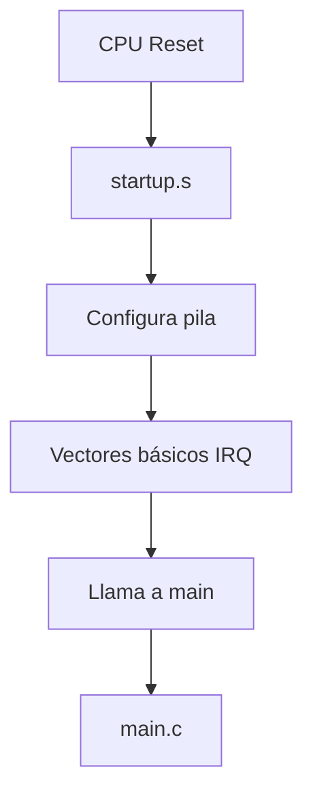
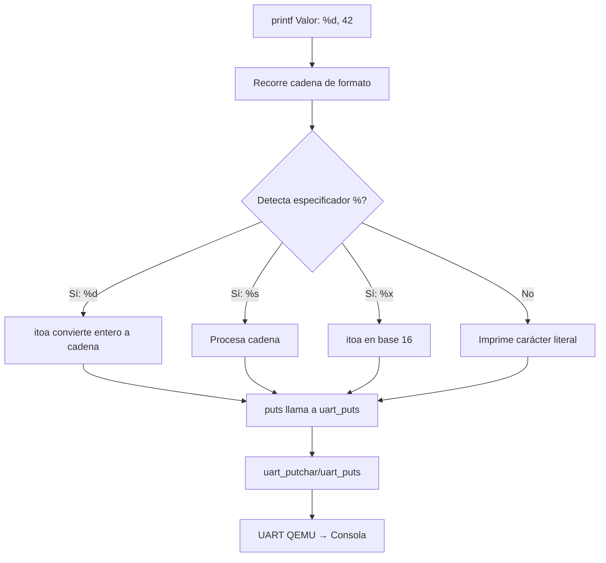
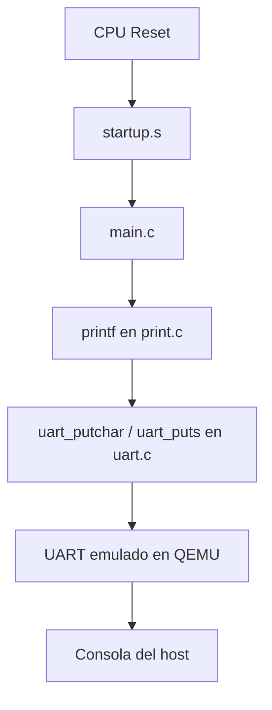

# Implementación de `printf` minimalista en QEMU

## 1. Introducción

Este "mini–proyecto" tuvo como objetivo implementar un mecanismo simple de salida por consola en un entorno bare–metal ejecutado sobre QEMU. Al trabajar sin sistema operativo ni librerías estándar como `newlib`, no existía una forma directa de mostrar información durante la ejecución, lo que dificultaba la depuración y validación del código. 

Para resolver este problema se desarrolló un `printf` minimalista, capaz de imprimir cadenas y valores numéricos en formato decimal y hexadecimal. La implementación se apoyó en primitivas básicas de escritura (`putchar` y `puts`), que se conectaron con las funcionalidades de QEMU para redirigir la salida al host. 

El propósito principal fue contar con una herramienta ligera de depuración que permitiera visualizar resultados intermedios y finales del programa. Aunque se trata de una versión limitada de `printf`, es suficiente para proyectos de bajo nivel y constituye la base para integrar capacidades de salida de texto en implementaciones posteriores más complejas, como el proyecto TEA.

---

## 2. Marco Teórico

Cuando se trabaja en un entorno bare–metal no se dispone de las librerías estándar que normalmente facilitan la entrada y salida de datos, como `stdio.h` y su conocida función `printf`. Esto implica que el programador debe implementar sus propias rutinas de comunicación para enviar caracteres desde el microcontrolador (o procesador simulado en QEMU) hacia el entorno del host, de manera que la información pueda visualizarse en consola.

### 2.1 Comunicación serie y UART
El método más común para transmitir datos en sistemas embebidos es la comunicación serie mediante un **UART (Universal Asynchronous Receiver–Transmitter)** [1].  
Un UART es un periférico encargado de convertir los datos paralelos del procesador en una secuencia de bits que se envían por una línea de transmisión (TX), y de la misma forma, recibirlos en la línea de recepción (RX) [1].  
Algunas de sus características principales son:
- Comunicación asíncrona, sin necesidad de reloj compartido [1].
- Parámetros configurables: velocidad en baudios, número de bits de datos, bit de paridad y bits de parada [1].
- Registros de control y estado que permiten enviar y recibir bytes [1].

En hardware real, un `printf` bare–metal suele estar ligado a enviar cada carácter a través del UART físico conectado al PC. El PC, mediante un adaptador USB–Serie, interpreta esos caracteres y los muestra en un terminal [1].

### 2.2 UART en QEMU
QEMU, al emular plataformas ARM como `versatilepb` (por ejemplo), incluye un modelo del periférico UART. Esto permite que cualquier escritura en los registros de transmisión del UART simulado se redirija a la salida estándar del host (normalmente la terminal donde se ejecuta QEMU).  
De esta manera, no es necesario contar con un UART físico: basta con implementar las rutinas que escriben en el registro correcto del UART emulado para que los caracteres aparezcan en la consola [2] [3] [4].

Adicionalmente, QEMU soporta **semihosting**, un mecanismo alternativo donde el programa en ejecución puede invocar llamadas especiales para imprimir directamente en la salida del host. Este método también puede emplearse para simplificar la implementación de un `printf` minimalista [5] [6].

### 2.3 Funcionamiento de un `printf` sin `newlib`
La función `printf` estándar realiza tareas complejas: análisis de cadenas de formato, manejo de múltiples tipos de datos, y comunicación con el sistema operativo. En un entorno bare–metal estas dependencias no están disponibles, por lo que la implementación debe reducirse a lo esencial [7]:

1. **Conversión de datos a cadena**  
   - Enteros en decimal o hexadecimal se convierten a secuencias de caracteres ASCII mediante funciones auxiliares [7].
2. **Envío de caracteres individuales**  
   - Cada carácter de la cadena resultante se envía usando una rutina `putchar`, que escribe directamente en el periférico UART (o en el caso de QEMU, en el registro simulado) [7].
3. **Construcción de `printf` minimalista**  
   - La función `printf` se apoya en `putchar` y `puts` para recorrer la cadena de formato y mostrar los valores en consola [7].

### 2.4 Conexión a alto nivel
En resumen, el flujo de la implementación se puede entender en tres capas:

1. **Aplicación (C)**: el programa principal llama a `printf` para mostrar datos.  
2. **Primitivas de E/S**: `printf` utiliza funciones auxiliares como `putchar`, que gestionan el envío de cada carácter.  
3. **Hardware/Simulación**: en hardware real, `putchar` escribe en el registro del UART; en QEMU, esa escritura es capturada por el emulador y mostrada en la terminal del host.

Este enfoque garantiza una forma sencilla pero funcional de obtener salida por consola en un entorno sin sistema operativo, lo que resulta fundamental para la depuración y el desarrollo de proyectos embebidos.

---

## 3. Entorno de desarrollo
### 3.1 Herramientas utilizadas
- **Docker** (entorno controlado con toolchain ARM).
- **Compilador cruzado**: `arm-none-eabi-gcc`.
- **QEMU**: simulador de arquitectura ARM.
- **GDB**: depuración a nivel de registros y memoria.
- **Shell scripts** para automatizar tareas.

### 3.2 Estructura del proyecto

La organización del proyecto se realizó de forma modular, separando el código fuente, los scripts de compilación/ejecución y la documentación.  
A continuación se muestra la estructura general:

```

baremetal-printf/
├── build.sh
├── Dockerfile
├── linker.ld
├── main.o
├── print.o
├── run-direct.sh
├── run-qemu.sh
├── run.sh
├── startup.o
├── test.elf
├── uart.o
├── src/
│   ├── main.c
│   ├── print.c
│   ├── print.h
│   ├── startup.s
│   ├── uart.c
│   └── uart.h
└── Documentacion/
    └── readme.md

```

#### Explicación de los archivos

- **`build.sh`**  
  Script de compilación que invoca el compilador cruzado `arm-none-eabi-gcc`, enlaza los objetos y genera el binario final (`test.elf`).  

- **`Dockerfile`**  
  Define el entorno de compilación dentro de un contenedor Docker, asegurando que las herramientas necesarias (toolchain ARM, QEMU, GDB) estén disponibles y en la versión correcta.  

- **`linker.ld`**  
  Script de *linker* que especifica cómo se organizan las secciones de memoria (código, datos, pila) en el ejecutable bare-metal.  

- **`main.o`, `print.o`, `startup.o`, `uart.o`**  
  Archivos objeto generados tras la compilación de los fuentes en `src/`. No deben editarse manualmente.  

- **`test.elf`**  
  Binario final en formato ELF que contiene el programa completo y es cargado en QEMU.  

- **`run-direct.sh`**  
  Script de prueba para ejecutar el binario directamente en QEMU sin opciones avanzadas.  

- **`run-qemu.sh`**  
  Script de ejecución estándar en QEMU, configurado con parámetros adecuados para emular la plataforma RISC-V.  

- **`run.sh`**  
  Script general que automatiza el flujo completo: compilar y luego ejecutar el programa en QEMU.  


#### Carpeta `src/`

- **`main.c`**  
  Programa principal. Contiene la lógica de prueba y llamadas a la función `printf` minimalista para verificar su funcionamiento.  

- **`print.c`**  
  Implementación del `printf` minimalista, junto con funciones auxiliares para formateo de enteros y cadenas.  

- **`print.h`**  
  Archivo de cabecera que declara las funciones disponibles en `print.c`.  

- **`startup.s`**  
  Código de arranque en ensamblador: inicializa la pila, vectores de interrupción y transfiere el control a `main`.  

- **`uart.c`**  
  Implementa las rutinas de comunicación a través del UART (en este caso, redirigido por QEMU a la consola del host).  

- **`uart.h`**  
  Cabecera de `uart.c`, declara las funciones de envío/recepción de caracteres.  


#### Carpeta `Documentacion/`

- **`readme.md`**  
  Documento donde se incluye la descripción general del proyecto, y detalles relevantes de la implementación.  

---

## 4. Implementación

Este mini–proyecto buscó demostrar cómo realizar una salida básica de texto en un entorno **bare–metal** sobre QEMU, sin apoyo de un sistema operativo ni de librerías estándar como `newlib`. Para lograrlo, se implementaron desde cero los siguientes componentes:

1. **Rutina de arranque (`startup.s`)** → prepara el entorno mínimo de ejecución.
2. **Módulo UART (`uart.c`)** → permite enviar caracteres hacia la consola a través del periférico emulado.
3. **`printf` minimalista (`print.c`)** → ofrece una funcionalidad reducida de formato de cadenas y enteros.
4. **Programa principal (`main.c`)** → utiliza los módulos anteriores para realizar pruebas de impresión.


### 4.1 Inicialización del sistema

La primera parte del flujo ocurre en **`startup.s`**, que es el código ensamblador encargado de:

- Configurar la pila (stack).
- Definir vectores mínimos de interrupción.
- Transferir el control a la función `main` escrita en C.

Esto permite que el procesador (emulado en QEMU) pueda ejecutar correctamente el código C posterior.

**Diagrama de flujo (Mermaid):**



### 4.2 Módulo UART

El **UART (Universal Asynchronous Receiver/Transmitter)** es el periférico encargado de la comunicación serie. En QEMU, este módulo se encuentra emulado, de manera que todo lo que se envíe a través de él se refleja directamente en la consola del host.

Funciones implementadas en `uart.c`:

* `uart_putchar(char c)` → envía un carácter.
* `uart_puts(const char *s)` → envía una cadena de caracteres.
* `uart_getchar(void)` → recibe un carácter (no usado en este proyecto, pero disponible).

**Flujo de comunicación:**


### 4.3 `printf` minimalista

El archivo `print.c` contiene la lógica del `printf` casero.
Se implementó con las siguientes características:

* Soporte de **cadenas (`%s`)**.
* Soporte de **enteros en decimal (`%d`)**.
* Soporte de **enteros en hexadecimal (`%x`)**.
* Conversión de enteros a cadena mediante una función auxiliar (`itoa`).
* Envío de cada carácter utilizando las rutinas UART previamente implementadas.

**Flujo de ejecución de `printf`:**



### 4.4 Programa principal (`main.c`)

El archivo `main.c` orquesta todo el sistema:

1. Se ejecuta después del `startup.s`.
2. Llama a `printf` para mostrar mensajes de prueba.
3. Entra en un bucle infinito (`while(1)`) para mantener el programa en ejecución.

Ejemplo:

```c
int main(void) {
    uart_init();
    print("Hola baremetal!\n");
    print("Numero decimal: %d\n", 1234);
    print("Numero hexadecimal: %x\n", 0xBEEF);
    print("Caracter: %c\n", 'A');
    print("Cadena: %s\n", "Embebidos");
    while (1); //Bucle infinito
}    
```


### 4.5 Flujo global del sistema

El funcionamiento completo del sistema puede resumirse en el siguiente diagrama:



---

### 4.6 Resumen de la implementación

* Se eliminó la dependencia de **librerías estándar** para lograr un control total del entorno bare–metal.
* Se desarrollaron **módulos específicos** (UART, `printf`, arranque).
* Se probó la salida en **QEMU**, validando la comunicación correcta.
* Se logró un **flujo completo** desde el arranque de la CPU hasta la visualización de mensajes en la consola del host.

---

## 5. Disclaimer

Este documento se apoyó en herramientas de IA (ChatGPT, GitHub Copilot) para redacción, corrección y organización; manteniendo control humano en diseño y decisiones técnicas.

---

## Referencias

[1] Wikipedia. (2025). *Universal asynchronous receiver-transmitter*. Disponible en: https://en.wikipedia.org/wiki/Universal_asynchronous_receiver-transmitter

[2] Stackoverflow. (2017). *printf in newlib is not working in baremetal ARM environment*. Disponible en: https://stackoverflow.com/questions/44932748/printf-in-newlib-is-not-working-in-baremetal-arm-environment

[3] popovicu94. (2025). *Bare metal printf - C standard library without OS*. Disponible en: https://popovicu.com/posts/bare-metal-printf/

[4] Qemu. (s.f).*Emulation*. Disponible en: https://www.qemu.org/docs/master/about/emulation.html

[5] Vysakh P. (2022). *Understanding RISC-V semihosting*. Disponible en: https://embeddedinn.com/articles/tutorial/understanding-riscv-semihosting

[6] Mistra Solutions. (2025). *Using QEMU UART interface*. Disponible en: https://www.mistrasolutions.com/page/qemu-uart-interface

[7] balau82. (2010). *Using Newlib in ARM bare metal programs*. Disponible en: https://balau82.wordpress.com/2010/12/16/using-newlib-in-arm-bare-metal-programs/?utm_source=chatgpt.com
