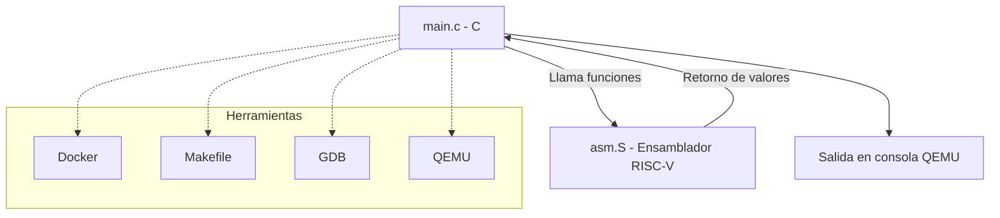

# Documentación Proyecto Individual - Arquitectura de Computadores I (CE4301)
## Implementación de Cifrado TEA usando C y Ensamblador RISC-V en QEMU

## 1. Introducción

### 1.1 Objetivo del proyecto

El objetivo principal de este proyecto fue **diseñar e implementar un sistema simple en arquitectura RISC-V**, combinando código en **C** y **ensamblador**, con el fin de comprender cómo interactúan ambos lenguajes a bajo nivel dentro de un flujo de ejecución controlado.
Se buscó, además, aplicar herramientas de depuración y emulación como **GDB** y **QEMU**, para validar el comportamiento del programa, analizar el manejo de registros y memoria, y documentar las decisiones de diseño adoptadas en la implementación.

### 1.2 Alcance de la implementación

El proyecto abarca la construcción de un flujo completo de desarrollo en ambiente controlado:

* **Diseño de la solución** dividiendo la lógica entre C y ensamblador, de acuerdo con las fortalezas de cada lenguaje.
* **Compilación y enlace** utilizando scripts `.sh`, un archivo de enlazado personalizado `.ld`, y la generación de archivos intermedios (`.o`) y ejecutables (`.elf`).
* **Ejecución en emulación** sobre la plataforma **QEMU RISC-V**, lo que permitió validar la portabilidad sin depender de hardware físico.
* **Depuración** a través de **GDB**, verificando el estado de registros, memoria y el flujo de ejecución.
* **Automatización** del proceso mediante el uso de **Docker** y **Makefiles**, asegurando un entorno de desarrollo reproducible.

Este alcance se limitó a la implementación funcional del sistema y a la validación de su comportamiento en emulación. No se contempló la ejecución en hardware físico ni optimizaciones avanzadas de rendimiento, aunque dichas extensiones podrían abordarse como mejoras futuras.

### 1.3 Tecnologías y herramientas utilizadas

El desarrollo se apoyó en un conjunto de herramientas y tecnologías que permitieron integrar tanto la parte de software como el flujo de compilación y pruebas:

* **Lenguajes de programación:**

  * **C** → para la lógica de alto nivel.
  * **Ensamblador RISC-V** → para secciones críticas de bajo nivel.

* **Archivos de soporte:**

  * **`.sh`** → scripts para automatizar compilación y ejecución.
  * **`.ld`** → archivo de enlazado para gestionar la organización en memoria.
  * **`.o`** → archivos objeto generados durante la compilación.
  * **`.elf`** → ejecutable final para la arquitectura RISC-V.

* **Herramientas principales:**

  * **QEMU** → emulación de la arquitectura RISC-V.
  * **GDB** → depuración paso a paso del sistema.
  * **Docker** → contenedor para reproducir el entorno de desarrollo.
  * **Makefile** → automatización de compilación y ejecución.

---

## 2. Arquitectura del Software

La arquitectura del sistema se diseñó bajo un esquema **modular y jerárquico**, donde el código en **C** se encargó de la lógica de más alto nivel, mientras que el **ensamblador RISC-V** gestionó operaciones de bajo nivel y control directo sobre registros y memoria. Esta separación permitió mantener claridad en la implementación, aprovechar la expresividad del lenguaje C y, al mismo tiempo, garantizar control fino sobre la arquitectura a través del ensamblador.

---

### 2.1 Separación entre capas C y ensamblador

#### 2.1.1 Rol del código en C

El lenguaje C cumplió un papel de **capa de control y lógica de aplicación**, siendo responsable de:

* Definir el flujo principal del programa (función `main`).
* Gestionar la entrada/salida a nivel de abstracción superior.
* Invocar funciones escritas en ensamblador para tareas específicas.
* Facilitar la lectura y comprensión del sistema al actuar como puente entre la lógica y el hardware simulado.

#### 2.1.2 Rol del código en ensamblador

El ensamblador RISC-V se utilizó para implementar **funcionalidades críticas de bajo nivel**, tales como:

* Operaciones aritméticas y lógicas directas en registros.
* Rutinas específicas que requieren control explícito del hardware simulado.
* Gestión de secciones de memoria definidas en el archivo de enlazado `.ld`.
* Implementación de funciones expuestas a C con optimización en instrucciones.

#### 2.1.3 Interacción entre ambos (interfaces y llamadas)

La interacción entre el código C y ensamblador se basó en:

* **Funciones escritas en ensamblador** y llamadas desde C.
* **Convenciones de llamada estándar de RISC-V (ABI)** para garantizar que los parámetros y resultados se pasaran correctamente mediante registros.
* Uso de símbolos exportados en ensamblador y declarados en C como `extern`.
* Proceso de compilación y enlace que integró ambas capas en el ejecutable final `.elf`.

---

### 2.2 Interfaces utilizadas

#### 2.2.1 Funciones expuestas desde C hacia ASM (y viceversa)

* Desde **C hacia ensamblador**:
  El código C definió funciones de alto nivel que, en determinados puntos, llamaban a rutinas ensamblador para realizar cálculos o manipulaciones directas de registros.

* Desde **ensamblador hacia C**:
  Algunas funciones de ensamblador devolvieron valores al programa en C (por ejemplo, resultados de operaciones aritméticas), siguiendo el protocolo de retorno definido por la ABI RISC-V.

#### 2.2.2 Manejo de convenciones de llamada (ABI, registros usados)

Para garantizar compatibilidad, se respetó la **ABI RISC-V (Application Binary Interface)**, que define:

* Parámetros de entrada en registros `a0–a7`.
* Valor de retorno en `a0`.
* Preservación de registros de propósito específico (`s0–s11`) por parte de las funciones en ensamblador.
* Uso del stack pointer (`sp`) y frame pointer (`fp`) en las llamadas anidadas.

Esto aseguró que el compilador pudiera enlazar sin conflictos y que el paso de datos entre C y ensamblador fuera consistente.

---

### 2.3 Decisiones de diseño y justificación

#### 2.3.1 Elección de qué lógica implementar en C y cuál en ASM

* **C**: Se destinó a la **estructura general del sistema**, ya que permite mantener claridad, legibilidad y escalabilidad en la implementación.
* **ASM**: Se utilizó en las **operaciones críticas** que requerían control directo del hardware emulado, optimización en instrucciones o manipulación de registros.

#### 2.3.2 Simplificaciones / optimizaciones realizadas

* Se evitó la duplicación de funciones: la lógica repetitiva se dejó en C, mientras que el ensamblador se enfocó en rutinas atómicas y optimizadas.
* Se implementó un archivo `.ld` personalizado para controlar la disposición de las secciones de memoria, lo que simplificó la organización y depuración.
* Se recurrió a **scripts `.sh` y Makefiles** para automatizar compilación y ejecución, optimizando el flujo de trabajo.

#### 2.3.3 Posibles alternativas descartadas

* Implementar todo el sistema únicamente en ensamblador → descartado por la complejidad, la pérdida de claridad y la dificultad en la depuración.
* Implementar todo en C → descartado porque no habría exposición directa al bajo nivel, ni se lograría el objetivo del curso de practicar ensamblador RISC-V.
* Uso de hardware físico → descartado por limitaciones de tiempo y costo, optando por **QEMU** como emulador confiable y portable.

---

### 2.4 Diagramas de Arquitectura y Flujo

#### 2.4.1 Diagrama de Arquitectura por Capas

---

#### 2.4.2 Flujo de Ejecución Simplificado

---

## 3. Funcionalidades Implementadas

* **3.1 Descripción general de las funcionalidades**
* **3.2 Flujo de ejecución principal**

  * 3.2.1 Entrada de datos
  * 3.2.2 Procesamiento
  * 3.2.3 Salida de resultados
* **3.3 Casos de uso o escenarios de ejemplo**

---

## 4. Evidencias de Ejecución (GDB y QEMU)

* **4.1 Ejecución en QEMU**

  * 4.1.1 Capturas de pantalla o logs de ejecución
  * 4.1.2 Explicación de la salida obtenida
* **4.2 Debugging con GDB**

  * 4.2.1 Ejemplo de sesión GDB paso a paso
  * 4.2.2 Breakpoints utilizados
  * 4.2.3 Validación de resultados (registros, memoria, etc.)

---

## 5. Resultados y Discusión

* **5.1 Resultados generales de la implementación**
* **5.2 Análisis de rendimiento**

  * 5.2.1 Tiempo de ejecución aproximado / eficiencia
  * 5.2.2 Diferencias entre C y ensamblador en el proyecto
* **5.3 Limitaciones actuales**
* **5.4 Posibles mejoras futuras**

---

## 6. Guía de Uso: Compilación, Ejecución y Pruebas

* **6.1 Requisitos previos**

  * Instalación de `gcc`, `make`, `qemu`, `gdb`, etc.
* **6.2 Compilación**

  * Ejemplo de comando con `make` o `gcc`
* **6.3 Ejecución en QEMU**

  * Ejemplo de ejecución básica
* **6.4 Depuración con GDB**

  * Ejemplo de conexión con QEMU (`target remote`)
* **6.5 Ejemplos de uso del sistema**

  * Entrada esperada
  * Salida obtenida

---

## 7. Conclusiones

* **7.1 Principales aprendizajes del proyecto**
* **7.2 Relevancia para la arquitectura de computadores**
* **7.3 Reflexión personal / académica**

---

## 8. Referencias
