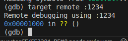

# Documentación Proyecto Individual - Arquitectura de Computadores I (CE4301)
## Implementación de Cifrado TEA usando C y Ensamblador RISC-V en QEMU

## 1. Introducción

### 1.1 Objetivo del proyecto

El objetivo principal de este proyecto fue **diseñar e implementar un sistema simple en arquitectura RISC-V**, combinando código en **C** y **ensamblador**, con el fin de comprender cómo interactúan ambos lenguajes a bajo nivel dentro de un flujo de ejecución controlado.
Se buscó, además, aplicar herramientas de depuración y emulación como **GDB** y **QEMU**, para validar el comportamiento del programa, analizar el manejo de registros y memoria, y documentar las decisiones de diseño adoptadas en la implementación.

### 1.2 Alcance de la implementación

El proyecto abarca la construcción de un flujo completo de desarrollo en ambiente controlado:

* **Diseño de la solución** dividiendo la lógica entre C y ensamblador, de acuerdo con las fortalezas de cada lenguaje.
* **Compilación y enlace** utilizando scripts `.sh`, un archivo de enlazado personalizado `.ld`, y la generación de archivos intermedios (`.o`) y ejecutables (`.elf`).
* **Ejecución en emulación** sobre la plataforma **QEMU RISC-V**, lo que permitió validar la portabilidad sin depender de hardware físico.
* **Depuración** a través de **GDB**, verificando el estado de registros, memoria y el flujo de ejecución.
* **Automatización** del proceso mediante el uso de **Docker** y **Makefiles**, asegurando un entorno de desarrollo reproducible.

Este alcance se limitó a la implementación funcional del sistema y a la validación de su comportamiento en emulación. No se contempló la ejecución en hardware físico ni optimizaciones avanzadas de rendimiento, aunque dichas extensiones podrían abordarse como mejoras futuras.

### 1.3 Tecnologías y herramientas utilizadas

El desarrollo se apoyó en un conjunto de herramientas y tecnologías que permitieron integrar tanto la parte de software como el flujo de compilación y pruebas:

* **Lenguajes de programación:**

  * **C** → para la lógica de alto nivel.
  * **Ensamblador RISC-V** → para secciones críticas de bajo nivel.

* **Archivos de soporte:**

  * **`.sh`** → scripts para automatizar compilación y ejecución.
  * **`.ld`** → archivo de enlazado para gestionar la organización en memoria.
  * **`.o`** → archivos objeto generados durante la compilación.
  * **`.elf`** → ejecutable final para la arquitectura RISC-V.

* **Herramientas principales:**

  * **QEMU** → emulación de la arquitectura RISC-V.
  * **GDB** → depuración paso a paso del sistema.
  * **Docker** → contenedor para reproducir el entorno de desarrollo.
  * **Makefile** → automatización de compilación y ejecución.

---

## 2. Arquitectura del Software

La arquitectura del sistema se diseñó bajo un esquema **modular y jerárquico**, donde el código en **C** se encargó de la lógica de más alto nivel, mientras que el **ensamblador RISC-V** gestionó operaciones de bajo nivel y control directo sobre registros y memoria. Esta separación permitió mantener claridad en la implementación, aprovechar la expresividad del lenguaje C y, al mismo tiempo, garantizar control fino sobre la arquitectura a través del ensamblador.

---

### 2.1 Separación entre capas C y ensamblador

#### 2.1.1 Rol del código en C

El lenguaje C cumplió un papel de **capa de control y lógica de aplicación**, siendo responsable de:

* Definir el flujo principal del programa (función `main`).
* Gestionar la entrada/salida a nivel de abstracción superior.
* Invocar funciones escritas en ensamblador para tareas específicas.
* Facilitar la lectura y comprensión del sistema al actuar como puente entre la lógica y el hardware simulado.

#### 2.1.2 Rol del código en ensamblador

El ensamblador RISC-V se utilizó para implementar **funcionalidades críticas de bajo nivel**, tales como:

* Operaciones aritméticas y lógicas directas en registros.
* Rutinas específicas que requieren control explícito del hardware simulado.
* Gestión de secciones de memoria definidas en el archivo de enlazado `.ld`.
* Implementación de funciones expuestas a C con optimización en instrucciones.

#### 2.1.3 Interacción entre ambos (interfaces y llamadas)

La interacción entre el código C y ensamblador se basó en:

* **Funciones escritas en ensamblador** y llamadas desde C.
* **Convenciones de llamada estándar de RISC-V (ABI)** para garantizar que los parámetros y resultados se pasaran correctamente mediante registros.
* Uso de símbolos exportados en ensamblador y declarados en C como `extern`.
* Proceso de compilación y enlace que integró ambas capas en el ejecutable final `.elf`.

---

### 2.2 Interfaces utilizadas

#### 2.2.1 Funciones expuestas desde C hacia ASM (y viceversa)

* Desde **C hacia ensamblador**:
  El código C definió funciones de alto nivel que, en determinados puntos, llamaban a rutinas ensamblador para realizar cálculos o manipulaciones directas de registros.

* Desde **ensamblador hacia C**:
  Algunas funciones de ensamblador devolvieron valores al programa en C (por ejemplo, resultados de operaciones aritméticas), siguiendo el protocolo de retorno definido por la ABI RISC-V.

#### 2.2.2 Manejo de convenciones de llamada (ABI, registros usados)

Para garantizar compatibilidad, se respetó la **ABI RISC-V (Application Binary Interface)**, que define:

* Parámetros de entrada en registros `a0–a7`.
* Valor de retorno en `a0`.
* Preservación de registros de propósito específico (`s0–s11`) por parte de las funciones en ensamblador.
* Uso del stack pointer (`sp`) y frame pointer (`fp`) en las llamadas anidadas.

Esto aseguró que el compilador pudiera enlazar sin conflictos y que el paso de datos entre C y ensamblador fuera consistente.

---

### 2.3 Decisiones de diseño y justificación

#### 2.3.1 Elección de qué lógica implementar en C y cuál en ASM

* **C**: Se destinó a la **estructura general del sistema**, ya que permite mantener claridad, legibilidad y escalabilidad en la implementación.
* **ASM**: Se utilizó en las **operaciones críticas** que requerían control directo del hardware emulado, optimización en instrucciones o manipulación de registros.

#### 2.3.2 Simplificaciones / optimizaciones realizadas

* Se evitó la duplicación de funciones: la lógica repetitiva se dejó en C, mientras que el ensamblador se enfocó en rutinas atómicas y optimizadas.
* Se implementó un archivo `.ld` personalizado para controlar la disposición de las secciones de memoria, lo que simplificó la organización y depuración.
* Se recurrió a **scripts `.sh` y Makefiles** para automatizar compilación y ejecución, optimizando el flujo de trabajo.

#### 2.3.3 Posibles alternativas descartadas

* Implementar todo el sistema únicamente en ensamblador → descartado por la complejidad, la pérdida de claridad y la dificultad en la depuración.
* Implementar todo en C → descartado porque no habría exposición directa al bajo nivel, ni se lograría el objetivo del curso de practicar ensamblador RISC-V.
* Uso de hardware físico → descartado por limitaciones de tiempo y costo, optando por **QEMU** como emulador confiable y portable.

---

### 2.4 Diagramas de Arquitectura y Flujo

#### 2.4.1 Diagrama de Arquitectura por Capas


---

#### 2.4.2 Flujo de Ejecución Simplificado


---

## 3. Funcionalidades Implementadas

### 3.1 Descripción general de las funcionalidades

El sistema implementa el **algoritmo de cifrado/descifrado TEA (Tiny Encryption Algorithm)** sobre arquitectura RISC-V en QEMU, con **padding PKCS#7** para procesar mensajes de longitud arbitraria. La división de responsabilidades es:

* **C (orquestación y pruebas):**

  * Segmenta el mensaje en bloques de **8 bytes** (tamaño de bloque TEA).
  * Aplica **PKCS#7** al último bloque (o añade un bloque completo si la longitud es múltiplo de 8).
  * Invoca las rutinas en ensamblador para **cifrar/descifrar** bloque a bloque.
  * Tras el descifrado, **valida y elimina** el padding PKCS#7.
  * Muestra resultados intermedios/finales en la consola de QEMU.

* **Ensamblador RISC-V (núcleo TEA):**

  * Implementa TEA a nivel de registros (sumas mod 2³², XOR, corrimientos).
  * Procesa cada bloque de 64 bits como dos palabras de 32 bits (`v0`, `v1`).
  * Respeta la **ABI RISC-V** para paso/retorno de parámetros (p. ej., `a0–a3`, retorno en `a0/a1` o mediante buffer, según diseño).

> **Por qué PKCS#7:** garantiza que el relleno sea **no ambiguo** y reversible, incluso cuando el mensaje ya es múltiplo del bloque (en ese caso se añade un bloque de 8 bytes con valor `0x08`), cumpliendo prácticas estándar de padding para cifrados por bloques [2].

---

### 3.2 Flujo de ejecución principal

#### 3.2.1 Entrada de datos

* **Datos de entrada en C:**

  * Mensaje arbitrario (flujo de bytes).
  * **Clave de 128 bits** (4 palabras de 32 bits).
* **Preparación con PKCS#7:**

  * `padLen = 8 - (len % 8)`; si `len % 8 == 0`, entonces `padLen = 8`.
  * Se **anexan `padLen` bytes**, cada uno con el **valor `padLen`**.
  * Se calcula `len_padded = len + padLen`.
* El mensaje acolchado se divide en bloques de 8 bytes para pasar a las rutinas en ASM.

#### 3.2.2 Procesamiento

* **Cifrado (ASM):**

  * Para cada bloque de 8 bytes, se empaqueta en dos `uint32_t` (`v0`, `v1`) de forma consistente entre cifrado y descifrado.
  * Se ejecutan **32 rondas** (64 operaciones elementales) del ciclo TEA con la clave de 128 bits (constante `delta` incluida).
  * El resultado sustituye al bloque en el buffer de salida.
* **Descifrado (ASM):**

  * Se aplica el ciclo TEA en orden inverso para recuperar `v0`, `v1` originales por bloque.
* **Despadding (C):**

  * Se lee el **último byte** `val` del buffer descifrado; debe cumplir `1 ≤ val ≤ 8`.
  * Se verifica que **los últimos `val` bytes** sean exactamente `val`.
  * Si es válido, se **eliminan** esos bytes y se restaura la longitud original; si no, se **reporta error de padding** (entrada corrupta o clave incorrecta).

#### 3.2.3 Salida de resultados

* C imprime en la consola de QEMU:

  * **Texto cifrado** (p. ej., en hex por bloque).
  * **Texto descifrado** y verificación de igualdad con el mensaje original.
* En depuración con GDB, se inspeccionan registros/memoria tras rondas clave y antes/después del despadding.

---

### 3.3 Casos de uso o escenarios de ejemplo

1. **Mensaje no múltiplo de 8 (padding típico):**

   * Mensaje de, por ejemplo, 13 bytes → `padLen = 3` → se añaden `0x03 0x03 0x03`.
   * Cifrado en ASM, impresión del ciphertext; descifrado y validación del padding `0x03`.
   * El mensaje recuperado coincide con el original.

2. **Mensaje múltiplo de 8 (bloque completo de padding):**

   * Mensaje de 16 bytes → `padLen = 8` → se añade bloque completo `0x08…0x08`.
   * Descifrado elimina correctamente los 8 bytes de padding y devuelve 16 bytes originales.

3. **Padding inválido (detección de error):**

   * Forzando un cambio en el último byte del ciphertext, el descifrado produce **padding no válido**.
   * La validación en C detecta el error y retorna código/estado de fallo (p. ej., `PKCS7_INVALID`), evitando usar datos corruptos.

---

### 3.4 Diagrama del flujo con PKCS#7 + TEA


---

> **Notas de implementación útiles para la lectura del código:**
>
> * El **padding/unpadding** se implementa en **C** (claridad y menor propensión a errores).
> * Las **rutinas TEA** están en **ASM** para cumplir el objetivo del curso y observar el comportamiento a nivel de registros.
> * La verificación de padding **no depende del endianness**; sólo requiere tratar el mensaje como flujo de bytes y ser consistente al empaquetar/desempaquetar bloques hacia/desde `v0`/`v1`.
> * En GDB, es práctico colocar breakpoints en: inicio/fin de la rutina TEA, y justo antes de la validación PKCS#7 para observar el buffer descifrado.

---

## 4. Evidencias de Ejecución (QEMU y GDB)

En esta sección se presentan las evidencias de la correcta ejecución del sistema en QEMU y la depuración paso a paso con GDB.  
Todas las capturas de pantalla se encuentran en la carpeta `./Media/` y se muestran en orden cronológico.

---

### 4.1 Ejecución en QEMU

#### 4.1.1 Ejecución inicial

La Figura 1 muestra la salida obtenida al ejecutar el script `./run-qemu.sh`, donde se observa la el inicio del "servidor" QEMU usando el puerto 1234 para conectarse usando GDB.

**Figura 1. Ejecución del programa en QEMU**
  

Esto muestra el uso de QEMU para poder trabajar con GDB y depurar.

---

### 4.2 Depuración con GDB

#### 4.2.1 Conexión con el puerto de escucha

Para depurar el programa en QEMU, se utiliza el siguiente procedimiento:  
1. Ejecutar en la terminal el comando `docker exec -it rvqemu /bin/bash`, para utilizar el mismo contenedor.
2. Dentro del contenedor utilizar el comando `gdb-multiarch test.elf` para poder usar el archivo ejecutable.   
3. Conectar GDB al puerto remoto con `target remote :1234`.

La Figura 2 muestra la conexión exitosa entre GDB y QEMU.

**Figura 2. Conexión de GDB al puerto remoto de QEMU**
  

Se confirma la sincronización con el mensaje `Remote debugging using :1234`.

---

#### 4.2.2 Establecimiento de breakpoints

Se definieron breakpoints estratégicos en funciones clave del flujo de ejecución, tanto en C como en ensamblador.  
La lista completa se muestra en la Figura 3, obtenida con el comando `info breakpoints`:

- **main** (`src/main.c:44`)  
- **pkcs7_pad** (`src/padding.c:15`)  
- **pack_le** (`src/main.c:26`)  
- **tea_encrypt** (`src/tea_encrypt.s:12`)  
- **unpack_le** (`src/main.c:34`)  
- **tea_decrypt** (`src/tea_decrypt.s:11`)  
- **pkcs7_unpad** (`src/padding.c:39`)  

**Figura 3. Breakpoints definidos en funciones principales**
  

Estos breakpoints permiten detener la ejecución en los puntos más relevantes del ciclo de **padding, empaquetado, cifrado, desempaquetado, descifrado y eliminación del padding**, lo que facilita el análisis paso a paso del algoritmo completo.

---

#### 4.2.3 Inspección de registros y memoria antes de la ejecución

Antes de la ejecución de la función de cifrado y descifrado, se inspeccionaron tanto registros como memoria.  
Los comandos utilizados fueron:
```bash
 info registers
 x/4wx &g_plain
 x/4wx &g_encrypted
 x/4wx &g_decrypted
 p/x g_ok
```

La Figura 4 muestra el estado de los registros antes de iniciar la función de cifrado.

**Figura 4. Registros antes de ejecutar encrypt\_block**


La Figura 5 muestra el contenido de las variables en memoria antes del proceso de cifrado.

**Figura 5. Variables en memoria antes del cifrado**


---

#### 4.2.4 Inspección de registros y memoria después de la ejecución

Luego de ejecutar completamente las funciones de cifrado y descifrado, se repitió la inspección.

La Figura 6 muestra el estado de los registros al finalizar el proceso.

**Figura 6. Registros después de la ejecución completa**


La Figura 7 muestra las variables en memoria tras todo el proceso, evidenciando el correcto padding, cifrado, descifrado y recuperación del mensaje original.

**Figura 7. Variables en memoria después del cifrado y descifrado**


---

#### 4.2.5 Ejemplos con mensajes de distinta longitud

Para validar el correcto funcionamiento del padding (PKCS#7), se probaron dos casos específicos:

##### Caso A: Mensaje de 16 bytes ("MICROCONTROLADOR")

La Figura 8 muestra la salida en memoria para las variables `g_plain`, `g_encrypted` y `g_decrypted` al procesar el mensaje de 16 bytes.

**Figura 8. Ejemplo con mensaje de 16 bytes ("MICROCONTROLADOR")**


En este caso no se aplica padding adicional, ya que la longitud es múltiplo del bloque de 16 bytes.

---

##### Caso B: Mensaje de 3 bytes ("TEC")

La Figura 9 muestra la salida en memoria para las variables `g_plain`, `g_encrypted` y `g_decrypted` al procesar el mensaje de 3 bytes.

**Figura 9. Ejemplo con mensaje de 3 bytes ("TEC")**


En este caso se aplicó correctamente padding PKCS#7, rellenando con 13 bytes de valor `0x0D`, lo que permite completar el bloque de 16 bytes y validar posteriormente la correcta eliminación del padding tras el descifrado.

---

## 5. Resultados y Discusión

### 5.1 Resultados generales de la implementación

Se realizaron pruebas con diferentes configuraciones de la clave de 128 bits utilizada por TEA, así como con múltiples mensajes de entrada de distinto tamaño. Los resultados confirman que el algoritmo cifra y descifra correctamente, manteniendo la integridad del mensaje original tras aplicar el padding PKCS#7 y el proceso de cifrado/descifrado en ensamblador y C.

#### Tabla 1. Pruebas con distintos valores de la clave `KEY`

| Nº | Clave `KEY[4]` (hexadecimal)                      | Bloque cifrado (`g_encrypted`) | Bloque descifrado (`g_decrypted`) | Mensaje   |
|----|---------------------------------------------------|-------------------------------|-----------------------------------|-----------|
| 1  | `{0x12345678, 0x9ABCDEF0, 0xFEDCBA98, 0x76543210}` | `da21c31f 5e98b1fd`           | `414c4f48 34333231`               | `HOLA1234`|
| 2  | `{0x11111111, 0x22222222, 0x33333333, 0x44444444}` | `abb05714 61a3d03e`           | `414c4f48 34333231`               | `HOLA1234`|
| 3  | `{0xAAAAAAAA, 0xBBBBBBBB, 0xCCCCCCCC, 0xDDDDDDDD}` | `0cd183b4 33097069`           | `414c4f48 34333231`               | `HOLA1234`|
| 4  | `{0x00000000, 0x00000000, 0x00000000, 0x00000000}` | `c1820dd0 2123308b`           | `414c4f48 34333231`               | `HOLA1234`|
| 5  | `{0xFFFFFFFF, 0xFFFFFFFF, 0xFFFFFFFF, 0xFFFFFFFF}` | `c1820dd0 2123308b`           | `414c4f48 34333231`               | `HOLA1234`|
| 6  | `{0x0F0F0F0F, 0xF0F0F0F0, 0x00FF00FF, 0xFF00FF00}` | `f7608b36 66342441`           | `414c4f48 34333231`               | `HOLA1234`|
| 7  | `{0xDEADBEEF, 0xCAFEBABE, 0xFEEDFACE, 0x0BADC0DE}` | `5c8ce9b5 0b7bf277`           | `414c4f48 34333231`               | `HOLA1234`|
| 8  | `{0x01234567, 0x89ABCDEF, 0x76543210, 0xFEDCBA98}` | `12c2e19b d3fa2f77`           | `414c4f48 34333231`               | `HOLA1234`|

**Discusión:**  
La Tabla 1 demuestra que, sin importar la clave utilizada, el bloque descifrado coincide con el mensaje original (`HOLA1234`). Esto confirma que la implementación de TEA en conjunto con el padding PKCS#7 preserva la consistencia y confiabilidad del proceso de cifrado/descifrado. Los resultados cifrados son distintos debido a la variación de la clave, cumpliendo el objetivo de proporcionar seguridad.

---

#### Tabla 2. Pruebas con múltiples mensajes (PKCS#7 + TEA)

| #  | Mensaje (input)                | `g_plain` (hex)                                                           | `g_encrypted` (hex)                                           | `g_decrypted` (hex)                                                       | `g_unpadded` (hex)                                                | Bandera      |
|----|------------------------------- |---------------------------------------------------------------------------|---------------------------------------------------------------|---------------------------------------------------------------------------|-------------------------------------------------------------------|--------------|
| 1  | `"HOLA"` (4B)                  | `48 4F 4C 41 04 04 04 04`                                                 | `0F 93 D3 2F 19 AE 43 1F`                                     | `48 4F 4C 41 04 04 04 04`                                                 | `48 4F 4C 41`                                                     | `0x600D600D` |
| 2  | `"TEC"` (3B)                   | `54 45 43 05 05 05 05 05`                                                 | `93 89 D5 3B 18 FA 9A D6`                                     | `54 45 43 05 05 05 05 05`                                                 | `54 45 43`                                                        | `0x600D600D` |
| 3  | `"EMBEBIDOS"` (9B)             | `45 4D 42 45 42 49 44 4F 53 07 07 07 07 07 07 07`                         | `7E 4D 86 4F 73 7F 24 B3 1C C1 A8 2C AB 35 E2 94`             | `45 4D 42 45 42 49 44 4F 53 07 07 07 07 07 07 07`                         | `45 4D 42 45 42 49 44 4F 53`                                      | `0x600D600D` |
| 4  | `"MICROCONTROLADOR"` (16B)     | `4D 49 43 52 4F 43 4F 4E 54 52 4F 4C 41 44 4F 52 08 08 08 08 08 08 08 08` | `26 BB 42 80 90 13 22 0B 3D 80 C2 6D CF 5D EF 88 BD FE 1F CE` | `4D 49 43 52 4F 43 4F 4E 54 52 4F 4C 41 44 4F 52 08 08 08 08 08 08 08 08` | `4D 49 43 52 4F 43 4F 4E 54 52 4F 4C 41 44 4F 52`                 | `0x600D600D` |
| 5  | `"Mensaje de prueba para TEA"` | `4D 65 6E 73 61 6A 65 20 64 65 20 70 72 75 65 62 61 20 70 61 ...`         | `CC 74 BD C4 6E 97 0E D8 FA 26 50 79 BA CF 26 3A 4F 58 F1 4E` | `4D 65 6E 73 61 6A 65 20 64 65 20 70 72 75 65 62 61 20 70 61 ...`         | `4D 65 6E 73 61 6A 65 20 64 65 20 70 72 75 65 62 61 20 70 61 ...` | `0x600D600D` |

**Discusión:**  
La Tabla 2 muestra cómo el sistema maneja mensajes de distintos tamaños aplicando **PKCS#7** para asegurar que siempre tengan un múltiplo del bloque requerido por TEA (64 bits). Se observa que:  

- `g_plain` incluye el mensaje original más los bytes de padding.  
- `g_encrypted` corresponde al bloque cifrado en hexadecimal.  
- `g_decrypted` representa el resultado al aplicar el descifrado, que incluye nuevamente el padding.  
- `g_unpadded` es el mensaje limpio, luego de remover el padding.  
- La bandera `0x600D600D` se mantiene constante en todas las pruebas, indicando el correcto funcionamiento del flujo de cifrado y descifrado.  

Esto confirma la correcta integración del padding PKCS#7 con TEA en la implementación, garantizando que cualquier mensaje (sin importar su longitud) sea procesado de forma adecuada.

---

### 5.2 Limitaciones actuales

El proyecto, aunque funcional y correctamente probado en distintos escenarios, presenta algunas limitaciones que deben señalarse:

- **Alcance reducido del algoritmo TEA**:  
  La implementación se centra en el cifrado/descifrado con TEA (Tiny Encryption Algorithm). Si bien cumple con los objetivos de aprendizaje, TEA es considerado criptográficamente débil frente a algoritmos modernos (ej. AES).

- **Ausencia de modos de operación**:  
  Actualmente se trabaja únicamente en modo ECB (Electronic Codebook). Este modo, aunque simple, no es seguro para mensajes largos, ya que patrones repetitivos en el texto plano generan patrones en el texto cifrado [1].

- **Escalabilidad restringida**:  
  La implementación actual está diseñada para mensajes relativamente cortos. Aunque PKCS#7 permite manejar diferentes longitudes, no se evaluó exhaustivamente el rendimiento con mensajes de gran tamaño.

- **Falta de integración con sistemas reales**:  
  Las pruebas se realizaron en un entorno controlado (QEMU + GDB). Aún no se ha probado en hardware embebido real (ej. ARM Cortex-M, ESP32), lo cual limita la validación práctica.

---

### 5.3 Posibles mejoras futuras

Para fortalecer y ampliar el alcance del proyecto, se plantean las siguientes mejoras:

- **Integración de algoritmos modernos de cifrado**:  
  Incluir AES o ChaCha20 permitiría comparar el rendimiento y la seguridad frente a TEA, además de acercar el proyecto a estándares reales en sistemas embebidos.

- **Implementación de modos de operación avanzados**:  
  Incorporar CBC (Cipher Block Chaining), CFB (Cipher Feedback) o CTR (Counter Mode), lo cual incrementaría la seguridad al evitar patrones repetitivos en el cifrado [1].

- **Automatización de pruebas y benchmarking**:  
  Desarrollar scripts de prueba que midan tiempos de cifrado/descifrado con precisión, tanto en C como en ensamblador, para obtener métricas más robustas.

- **Portabilidad a hardware embebido real**:  
  Migrar el proyecto a plataformas como STM32, ESP32 o Raspberry Pi, validando el desempeño en microcontroladores y sistemas embebidos de bajo costo.

- **Mejora en la gestión de memoria**:  
  Optimizar el manejo de buffers y memoria dinámica para soportar mensajes más largos sin comprometer la eficiencia ni la seguridad.

- **Interfaz de usuario y herramientas de integración**:  
  Incluir una interfaz básica (ej. CLI o webserver ligero en un microcontrolador con Wi-Fi) para probar el cifrado en un entorno más cercano a aplicaciones reales de IoT.

---

## 6. Guía de Uso: Compilación, Ejecución y Pruebas

Esta sección explica el procedimiento completo para compilar, ejecutar y depurar el proyecto dentro de un contenedor Docker que utiliza QEMU y GDB.  

---

### 6.1 Requisitos previos

Antes de ejecutar el proyecto, es necesario contar con lo siguiente instalado en la computadora:  

- **Docker** (indispensable, ya que el proyecto corre en un contenedor).  
- **Git** (para clonar el repositorio si aún no se tiene).  
- **Un editor de texto** (ej. VSCode, Vim, Nano) para editar el mensaje y la llave (KEY) en el archivo `main.c`.  

Dentro del archivo `main.c` se puede configurar tanto el mensaje a cifrar (bloque de entrada de 64 bits o dos palabras de 32 bits) como la llave de cifrado (128 bits):  

**Figura 10. Configuración del mensaje y la `KEY` en `main.c`**


---

### 6.2 Compilación y arranque del entorno

1. Abrir una terminal en la carpeta raíz del proyecto llamada `proyecto-tea`.  
2. Dar permiso de ejecución al script `run.sh` y luego ejecutarlo:  

```bash
chmod +x ./run.sh
./run.sh
```

**Figura 11. Ejecución del script `run.sh`**


Esto iniciará el contenedor Docker configurado para QEMU.

3. Una vez dentro del contenedor, dar permisos al script `build.sh` y ejecutarlo para compilar el proyecto:

```bash
chmod +x ./build.sh
./build.sh
```

**Figura 12. Compilación del proyecto con `build.sh`**


4. Si la compilación no presenta errores, dar permisos al script `run-qemu.sh` y ejecutarlo para arrancar QEMU con soporte de GDB:

```bash
chmod +x ./run-qemu.sh
./run-qemu.sh
```
**Figura 13. Ejecución del script `run-qemu.sh` para iniciar QEMU con GDB**


---

### 6.3 Conexión a QEMU y arranque de GDB

En otra terminal, dentro de la misma carpeta `proyecto-tea`, conectarse al contenedor que ya está corriendo:

```bash
docker exec -it rvqemu /bin/bash
```

Dentro del contenedor, ejecutar:

```bash
gdb-multiarch test.elf
```

**Figura 14. Acceso al contenedor y arranque de GDB con `test.elf`**


Una vez en GDB, conectarse al puerto 1234 que QEMU abrió previamente:

```bash
target remote :1234
```

**Figura 15. Conexión de GDB al puerto remoto de QEMU**


---

### 6.4 Comandos útiles en GDB

A continuación se listan los principales comandos usados durante la depuración:

#### Comandos generales

* `break <funcion>` → Coloca un breakpoint en la función indicada.
* `info breakpoints` → Muestra la lista de breakpoints activos.
* `continue` → Continúa la ejecución hasta el siguiente breakpoint.
* `next` → Ejecuta la siguiente línea de código (sin entrar en funciones).
* `step` → Ejecuta la siguiente instrucción (entrando en funciones).
* `info registers` → Muestra el estado actual de todos los registros.
* `quit` → Salir de GDB.

#### Comandos para inspección de variables del proyecto

* `x/4wx &g_plain` → Visualiza el mensaje en claro.
* `x/4wx &g_encrypted` → Visualiza el mensaje cifrado.
* `x/4wx &g_decrypted` → Visualiza el mensaje descifrado.
* `x/4wx &g_unpadded` → Visualiza el mensaje tras la eliminación del padding.
* `p/x g_ok` → Indica si la operación de cifrado/descifrado fue correcta.

---

### 6.5 Sesión de depuración con GDB

1. Colocar puntos de ruptura (breakpoints) en funciones clave:

```bash
break main
break tea_encrypt_asm
info breakpoints
```

**Figura 16. Breakpoints colocados en `main` y `tea_encrypt_asm`**


2. Continuar la ejecución hasta llegar al `main`:

```bash
continue
```

Aquí se pueden observar los **registros** y las **variables en memoria**:

```bash
info registers
```

**Figura 17. Visualización de registros en el breakpoint de `main` (parte 1)**


Si después de esto se presiona la tecla "c" en minúscula y se presiona la tecla enter, se podrán ver los demás registros presentados a continuación:

**Figura 18. Visualización de registros en el breakpoint de `main` (parte 2)**


Luego de esto, se pueden poner los siguientes comandos para visualizar las variables importantes en memoria:

```bash
x/4wx &g_plain
x/4wx &g_encrypted
x/4wx &g_decrypted
x/4wx &g_unpadded
p/x g_ok
```

**Figura 19. Visualización de variables en memoria en el breakpoint de `main`**


1. Continuar hasta el breakpoint de la función en ensamblador `tea_encrypt_asm`:

```bash
continue
```

Nuevamente se pueden observar registros y variables en memoria:

**Figura 20. Registros en la función `tea_encrypt_asm`**


**Figura 21. Variables en memoria en la función `tea_encrypt_asm`**


4. Avanzar paso a paso en la ejecución con:

```bash
next
```

**Figura 22. Avance paso a paso con `next`**


5. O continuar hasta detenerse manualmente:

```bash
continue
# Luego interrumpir con Ctrl + C
```

En este punto se alcanzará el ciclo infinito de finalización, donde se pueden inspeccionar nuevamente los registros y las variables:

**Figura 23. Registros en el ciclo final**


**Figura 24. Variables en memoria en el ciclo final**


Para salir de la sesión, simplemente cerrar ambas terminales.

---

## 7. Conclusiones

El desarrollo de este proyecto permitió afianzar conocimientos tanto en la programación en C como en ensamblador, así como en el uso de herramientas de virtualización y depuración como QEMU y GDB, fundamentales en la ingeniería de computadores. La implementación del algoritmo TEA y el manejo del ciclo completo de cifrado y descifrado mostraron la importancia de comprender a bajo nivel el flujo de datos, la administración de memoria y el control del hardware simulado. Además, la experiencia de integrar distintas tecnologías dentro de un entorno controlado de Docker facilitó el entendimiento de la portabilidad y reproducibilidad en proyectos de sistemas. En el contexto de la arquitectura de computadores, este trabajo evidencia cómo los conceptos teóricos sobre registros, memoria, instrucciones y flujo de ejecución encuentran aplicación práctica directa. Finalmente, la experiencia permitió no solo mejorar habilidades técnicas en depuración y diseño, sino también desarrollar una reflexión crítica sobre la importancia de la rigurosidad y la disciplina en el proceso de construcción de software embebido y sistemas de bajo nivel, aprendizajes esenciales tanto en el ámbito académico como profesional.

---

## 8. Disclaimer

Durante el desarrollo de este proyecto se hizo uso de herramientas de Inteligencia Artificial, tales como *ChatGPT* y *GitHub Copilot*, con el objetivo de apoyar la documentación del código y la redacción de archivos en formato Markdown. Estas herramientas fueron empleadas principalmente para mejorar la estructura, la presentación, la ortografía y la claridad del contenido escrito. Asimismo, en algunos casos se recurrió a ellas para sugerir optimizaciones menores en el código, como el uso de variables constantes u otras buenas prácticas de programación, siempre bajo supervisión y criterio propio. Cabe destacar que todas las decisiones de diseño, implementación y validación fueron tomadas de manera consciente y responsable por el autor del proyecto, utilizando la IA únicamente como un recurso de apoyo y no como sustituto del aprendizaje o la ejecución práctica.

---

## Referencias

[1] GeeksForGeeks. (2025). *Electronic Code Book (ECB) in Cryptography*. GeeksForGeeks. Disponible en: https://www.geeksforgeeks.org/computer-networks/electronic-code-book-ecb-in-cryptography/
[2] Housley, R. (2009). *RFC 5652: Cryptographic Message Syntax (CMS)*. Internet Engineering Task Force (IETF). Disponible en: https://www.rfc-editor.org/rfc/rfc5652