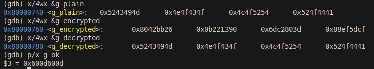

# Documentación Proyecto Individual - Arquitectura de Computadores I (CE4301)
## Implementación de Cifrado TEA usando C y Ensamblador RISC-V en QEMU

## 1. Introducción

### 1.1 Objetivo del proyecto

El objetivo principal de este proyecto fue **diseñar e implementar un sistema simple en arquitectura RISC-V**, combinando código en **C** y **ensamblador**, con el fin de comprender cómo interactúan ambos lenguajes a bajo nivel dentro de un flujo de ejecución controlado.
Se buscó, además, aplicar herramientas de depuración y emulación como **GDB** y **QEMU**, para validar el comportamiento del programa, analizar el manejo de registros y memoria, y documentar las decisiones de diseño adoptadas en la implementación.

### 1.2 Alcance de la implementación

El proyecto abarca la construcción de un flujo completo de desarrollo en ambiente controlado:

* **Diseño de la solución** dividiendo la lógica entre C y ensamblador, de acuerdo con las fortalezas de cada lenguaje.
* **Compilación y enlace** utilizando scripts `.sh`, un archivo de enlazado personalizado `.ld`, y la generación de archivos intermedios (`.o`) y ejecutables (`.elf`).
* **Ejecución en emulación** sobre la plataforma **QEMU RISC-V**, lo que permitió validar la portabilidad sin depender de hardware físico.
* **Depuración** a través de **GDB**, verificando el estado de registros, memoria y el flujo de ejecución.
* **Automatización** del proceso mediante el uso de **Docker** y **Makefiles**, asegurando un entorno de desarrollo reproducible.

Este alcance se limitó a la implementación funcional del sistema y a la validación de su comportamiento en emulación. No se contempló la ejecución en hardware físico ni optimizaciones avanzadas de rendimiento, aunque dichas extensiones podrían abordarse como mejoras futuras.

### 1.3 Tecnologías y herramientas utilizadas

El desarrollo se apoyó en un conjunto de herramientas y tecnologías que permitieron integrar tanto la parte de software como el flujo de compilación y pruebas:

* **Lenguajes de programación:**

  * **C** → para la lógica de alto nivel.
  * **Ensamblador RISC-V** → para secciones críticas de bajo nivel.

* **Archivos de soporte:**

  * **`.sh`** → scripts para automatizar compilación y ejecución.
  * **`.ld`** → archivo de enlazado para gestionar la organización en memoria.
  * **`.o`** → archivos objeto generados durante la compilación.
  * **`.elf`** → ejecutable final para la arquitectura RISC-V.

* **Herramientas principales:**

  * **QEMU** → emulación de la arquitectura RISC-V.
  * **GDB** → depuración paso a paso del sistema.
  * **Docker** → contenedor para reproducir el entorno de desarrollo.
  * **Makefile** → automatización de compilación y ejecución.

---

## 2. Arquitectura del Software

La arquitectura del sistema se diseñó bajo un esquema **modular y jerárquico**, donde el código en **C** se encargó de la lógica de más alto nivel, mientras que el **ensamblador RISC-V** gestionó operaciones de bajo nivel y control directo sobre registros y memoria. Esta separación permitió mantener claridad en la implementación, aprovechar la expresividad del lenguaje C y, al mismo tiempo, garantizar control fino sobre la arquitectura a través del ensamblador.

---

### 2.1 Separación entre capas C y ensamblador

#### 2.1.1 Rol del código en C

El lenguaje C cumplió un papel de **capa de control y lógica de aplicación**, siendo responsable de:

* Definir el flujo principal del programa (función `main`).
* Gestionar la entrada/salida a nivel de abstracción superior.
* Invocar funciones escritas en ensamblador para tareas específicas.
* Facilitar la lectura y comprensión del sistema al actuar como puente entre la lógica y el hardware simulado.

#### 2.1.2 Rol del código en ensamblador

El ensamblador RISC-V se utilizó para implementar **funcionalidades críticas de bajo nivel**, tales como:

* Operaciones aritméticas y lógicas directas en registros.
* Rutinas específicas que requieren control explícito del hardware simulado.
* Gestión de secciones de memoria definidas en el archivo de enlazado `.ld`.
* Implementación de funciones expuestas a C con optimización en instrucciones.

#### 2.1.3 Interacción entre ambos (interfaces y llamadas)

La interacción entre el código C y ensamblador se basó en:

* **Funciones escritas en ensamblador** y llamadas desde C.
* **Convenciones de llamada estándar de RISC-V (ABI)** para garantizar que los parámetros y resultados se pasaran correctamente mediante registros.
* Uso de símbolos exportados en ensamblador y declarados en C como `extern`.
* Proceso de compilación y enlace que integró ambas capas en el ejecutable final `.elf`.

---

### 2.2 Interfaces utilizadas

#### 2.2.1 Funciones expuestas desde C hacia ASM (y viceversa)

* Desde **C hacia ensamblador**:
  El código C definió funciones de alto nivel que, en determinados puntos, llamaban a rutinas ensamblador para realizar cálculos o manipulaciones directas de registros.

* Desde **ensamblador hacia C**:
  Algunas funciones de ensamblador devolvieron valores al programa en C (por ejemplo, resultados de operaciones aritméticas), siguiendo el protocolo de retorno definido por la ABI RISC-V.

#### 2.2.2 Manejo de convenciones de llamada (ABI, registros usados)

Para garantizar compatibilidad, se respetó la **ABI RISC-V (Application Binary Interface)**, que define:

* Parámetros de entrada en registros `a0–a7`.
* Valor de retorno en `a0`.
* Preservación de registros de propósito específico (`s0–s11`) por parte de las funciones en ensamblador.
* Uso del stack pointer (`sp`) y frame pointer (`fp`) en las llamadas anidadas.

Esto aseguró que el compilador pudiera enlazar sin conflictos y que el paso de datos entre C y ensamblador fuera consistente.

---

### 2.3 Decisiones de diseño y justificación

#### 2.3.1 Elección de qué lógica implementar en C y cuál en ASM

* **C**: Se destinó a la **estructura general del sistema**, ya que permite mantener claridad, legibilidad y escalabilidad en la implementación.
* **ASM**: Se utilizó en las **operaciones críticas** que requerían control directo del hardware emulado, optimización en instrucciones o manipulación de registros.

#### 2.3.2 Simplificaciones / optimizaciones realizadas

* Se evitó la duplicación de funciones: la lógica repetitiva se dejó en C, mientras que el ensamblador se enfocó en rutinas atómicas y optimizadas.
* Se implementó un archivo `.ld` personalizado para controlar la disposición de las secciones de memoria, lo que simplificó la organización y depuración.
* Se recurrió a **scripts `.sh` y Makefiles** para automatizar compilación y ejecución, optimizando el flujo de trabajo.

#### 2.3.3 Posibles alternativas descartadas

* Implementar todo el sistema únicamente en ensamblador → descartado por la complejidad, la pérdida de claridad y la dificultad en la depuración.
* Implementar todo en C → descartado porque no habría exposición directa al bajo nivel, ni se lograría el objetivo del curso de practicar ensamblador RISC-V.
* Uso de hardware físico → descartado por limitaciones de tiempo y costo, optando por **QEMU** como emulador confiable y portable.

---

### 2.4 Diagramas de Arquitectura y Flujo

#### 2.4.1 Diagrama de Arquitectura por Capas

---

#### 2.4.2 Flujo de Ejecución Simplificado

---

## 3. Funcionalidades Implementadas

### 3.1 Descripción general de las funcionalidades

El sistema implementa el **algoritmo de cifrado/descifrado TEA (Tiny Encryption Algorithm)** sobre arquitectura RISC-V en QEMU, con **padding PKCS#7** para procesar mensajes de longitud arbitraria. La división de responsabilidades es:

* **C (orquestación y pruebas):**

  * Segmenta el mensaje en bloques de **8 bytes** (tamaño de bloque TEA).
  * Aplica **PKCS#7** al último bloque (o añade un bloque completo si la longitud es múltiplo de 8).
  * Invoca las rutinas en ensamblador para **cifrar/descifrar** bloque a bloque.
  * Tras el descifrado, **valida y elimina** el padding PKCS#7.
  * Muestra resultados intermedios/finales en la consola de QEMU.

* **Ensamblador RISC-V (núcleo TEA):**

  * Implementa TEA a nivel de registros (sumas mod 2³², XOR, corrimientos).
  * Procesa cada bloque de 64 bits como dos palabras de 32 bits (`v0`, `v1`).
  * Respeta la **ABI RISC-V** para paso/retorno de parámetros (p. ej., `a0–a3`, retorno en `a0/a1` o mediante buffer, según diseño).

> **Por qué PKCS#7:** garantiza que el relleno sea **no ambiguo** y reversible, incluso cuando el mensaje ya es múltiplo del bloque (en ese caso se añade un bloque de 8 bytes con valor `0x08`), cumpliendo prácticas estándar de padding para cifrados por bloques [1].

---

### 3.2 Flujo de ejecución principal

#### 3.2.1 Entrada de datos

* **Datos de entrada en C:**

  * Mensaje arbitrario (flujo de bytes).
  * **Clave de 128 bits** (4 palabras de 32 bits).
* **Preparación con PKCS#7:**

  * `padLen = 8 - (len % 8)`; si `len % 8 == 0`, entonces `padLen = 8`.
  * Se **anexan `padLen` bytes**, cada uno con el **valor `padLen`**.
  * Se calcula `len_padded = len + padLen`.
* El mensaje acolchado se divide en bloques de 8 bytes para pasar a las rutinas en ASM.

#### 3.2.2 Procesamiento

* **Cifrado (ASM):**

  * Para cada bloque de 8 bytes, se empaqueta en dos `uint32_t` (`v0`, `v1`) de forma consistente entre cifrado y descifrado.
  * Se ejecutan **32 rondas** (64 operaciones elementales) del ciclo TEA con la clave de 128 bits (constante `delta` incluida).
  * El resultado sustituye al bloque en el buffer de salida.
* **Descifrado (ASM):**

  * Se aplica el ciclo TEA en orden inverso para recuperar `v0`, `v1` originales por bloque.
* **Despadding (C):**

  * Se lee el **último byte** `val` del buffer descifrado; debe cumplir `1 ≤ val ≤ 8`.
  * Se verifica que **los últimos `val` bytes** sean exactamente `val`.
  * Si es válido, se **eliminan** esos bytes y se restaura la longitud original; si no, se **reporta error de padding** (entrada corrupta o clave incorrecta).

#### 3.2.3 Salida de resultados

* C imprime en la consola de QEMU:

  * **Texto cifrado** (p. ej., en hex por bloque).
  * **Texto descifrado** y verificación de igualdad con el mensaje original.
* En depuración con GDB, se inspeccionan registros/memoria tras rondas clave y antes/después del despadding.

---

### 3.3 Casos de uso o escenarios de ejemplo

1. **Mensaje no múltiplo de 8 (padding típico):**

   * Mensaje de, por ejemplo, 13 bytes → `padLen = 3` → se añaden `0x03 0x03 0x03`.
   * Cifrado en ASM, impresión del ciphertext; descifrado y validación del padding `0x03`.
   * El mensaje recuperado coincide con el original.

2. **Mensaje múltiplo de 8 (bloque completo de padding):**

   * Mensaje de 16 bytes → `padLen = 8` → se añade bloque completo `0x08…0x08`.
   * Descifrado elimina correctamente los 8 bytes de padding y devuelve 16 bytes originales.

3. **Padding inválido (detección de error):**

   * Forzando un cambio en el último byte del ciphertext, el descifrado produce **padding no válido**.
   * La validación en C detecta el error y retorna código/estado de fallo (p. ej., `PKCS7_INVALID`), evitando usar datos corruptos.

---

### 3.4 Diagrama del flujo con PKCS#7 + TEA

---

> **Notas de implementación útiles para la lectura del código:**
>
> * El **padding/unpadding** se implementa en **C** (claridad y menor propensión a errores).
> * Las **rutinas TEA** están en **ASM** para cumplir el objetivo del curso y observar el comportamiento a nivel de registros.
> * La verificación de padding **no depende del endianness**; sólo requiere tratar el mensaje como flujo de bytes y ser consistente al empaquetar/desempaquetar bloques hacia/desde `v0`/`v1`.
> * En GDB, es práctico colocar breakpoints en: inicio/fin de la rutina TEA, y justo antes de la validación PKCS#7 para observar el buffer descifrado.

---

## 4. Evidencias de Ejecución (QEMU y GDB)

En esta sección se presentan las evidencias de la correcta ejecución del sistema en QEMU y la depuración paso a paso con GDB.  
Todas las capturas de pantalla se encuentran en la carpeta `./Media/` y se muestran en orden cronológico.

---

### 4.1 Ejecución en QEMU

#### 4.1.1 Ejecución inicial

La Figura 1 muestra la salida obtenida al ejecutar el script `./run-qemu.sh`, donde se observa la el inicio del "servidor" QEMU usando el puerto 1234 para conectarse usando GDB.

  

Esto muestra el uso de QEMU para poder trabajar con GDB y depurar.

---

### 4.2 Depuración con GDB

#### 4.2.1 Conexión con el puerto de escucha

Para depurar el programa en QEMU, se utiliza el siguiente procedimiento:  
1. Ejecutar en la terminal el comando `docker exec -it rvqemu /bin/bash`, para utilizar el mismo contenedor.
2. Dentro del contenedor utilizar el comando `gdb-multiarch test.elf` para poder usar el archivo ejecutable.   
3. Conectar GDB al puerto remoto con `target remote :1234`.

La Figura 2 muestra la conexión exitosa entre GDB y QEMU.

  

Se confirma la sincronización con el mensaje `Remote debugging using :1234`.

---

#### 4.2.2 Establecimiento de breakpoints

Se definieron breakpoints estratégicos en funciones clave del flujo de ejecución, tanto en C como en ensamblador.  
La lista completa se muestra en la Figura 3, obtenida con el comando `info breakpoints`:

- **main** (`src/main.c:44`)  
- **pkcs7_pad** (`src/padding.c:15`)  
- **pack_le** (`src/main.c:26`)  
- **tea_encrypt** (`src/tea_encrypt.s:12`)  
- **unpack_le** (`src/main.c:34`)  
- **tea_decrypt** (`src/tea_decrypt.s:11`)  
- **pkcs7_unpad** (`src/padding.c:39`)  

  

Estos breakpoints permiten detener la ejecución en los puntos más relevantes del ciclo de **padding, empaquetado, cifrado, desempaquetado, descifrado y eliminación del padding**, lo que facilita el análisis paso a paso del algoritmo completo.

---

#### 4.2.3 Inspección de registros y memoria antes de la ejecución

Antes de la ejecución de la función de cifrado y descifrado, se inspeccionaron tanto registros como memoria.  
Los comandos utilizados fueron:

La Figura 4 muestra el estado de los registros antes de iniciar la función de cifrado.

La Figura 5 muestra el contenido de las variables en memoria antes del proceso de cifrado.

---

#### 4.2.4 Inspección de registros y memoria después de la ejecución

Luego de ejecutar completamente las funciones de cifrado y descifrado, se repitió la inspección.

La Figura 6 muestra el estado de los registros al finalizar el proceso.

La Figura 7 muestra las variables en memoria tras todo el proceso, evidenciando el correcto padding, cifrado, descifrado y recuperación del mensaje original.

---

#### 4.2.5 Ejemplos con mensajes de distinta longitud

Para validar el correcto funcionamiento del padding (PKCS#7), se probaron dos casos específicos:

##### Caso A: Mensaje de 16 bytes ("MICROCONTROLADOR")

La Figura 8 muestra la salida en memoria para las variables `g_plain`, `g_encrypted` y `g_decrypted` al procesar el mensaje de 16 bytes.

En este caso no se aplica padding adicional, ya que la longitud es múltiplo del bloque de 16 bytes.

---

##### Caso B: Mensaje de 3 bytes ("TEC")

La Figura 9 muestra la salida en memoria para las variables `g_plain`, `g_encrypted` y `g_decrypted` al procesar el mensaje de 3 bytes.

En este caso se aplicó correctamente padding PKCS#7, rellenando con 13 bytes de valor `0x0D`, lo que permite completar el bloque de 16 bytes y validar posteriormente la correcta eliminación del padding tras el descifrado.

---

## 5. Resultados y Discusión

* **5.1 Resultados generales de la implementación**
* **5.2 Análisis de rendimiento**

  * 5.2.1 Tiempo de ejecución aproximado / eficiencia
  * 5.2.2 Diferencias entre C y ensamblador en el proyecto
* **5.3 Limitaciones actuales**
* **5.4 Posibles mejoras futuras**

---

## 6. Guía de Uso: Compilación, Ejecución y Pruebas

* **6.1 Requisitos previos**

  * Instalación de `gcc`, `make`, `qemu`, `gdb`, etc.
* **6.2 Compilación**

  * Ejemplo de comando con `make` o `gcc`
* **6.3 Ejecución en QEMU**

  * Ejemplo de ejecución básica
* **6.4 Depuración con GDB**

  * Ejemplo de conexión con QEMU (`target remote`)
* **6.5 Ejemplos de uso del sistema**

  * Entrada esperada
  * Salida obtenida

---

## 7. Conclusiones

* **7.1 Principales aprendizajes del proyecto**
* **7.2 Relevancia para la arquitectura de computadores**
* **7.3 Reflexión personal / académica**

---

## 8. Referencias

[1] Housley, R. (2009). *RFC 5652: Cryptographic Message Syntax (CMS)*. Internet Engineering Task Force (IETF). Disponible en: https://www.rfc-editor.org/rfc/rfc5652 